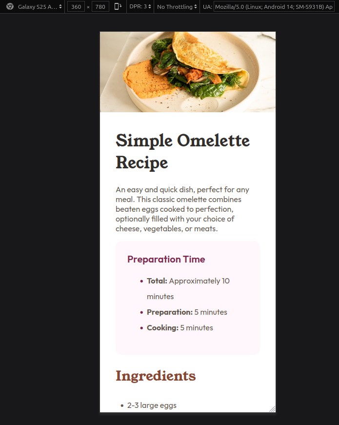
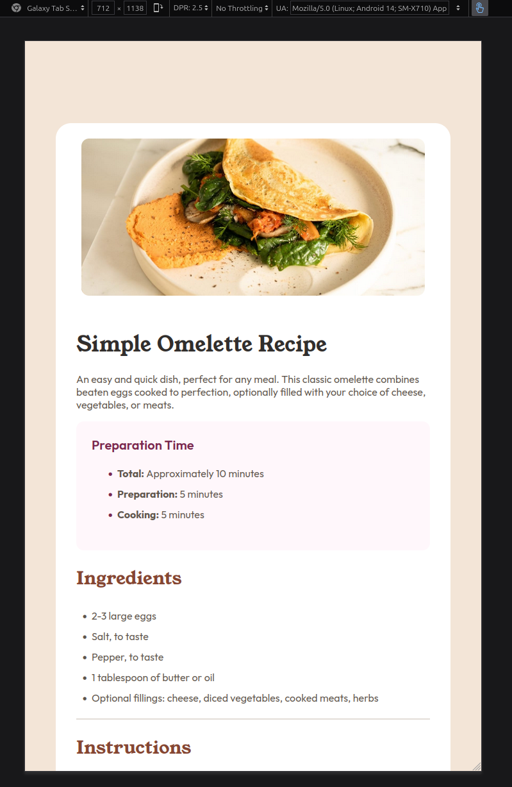
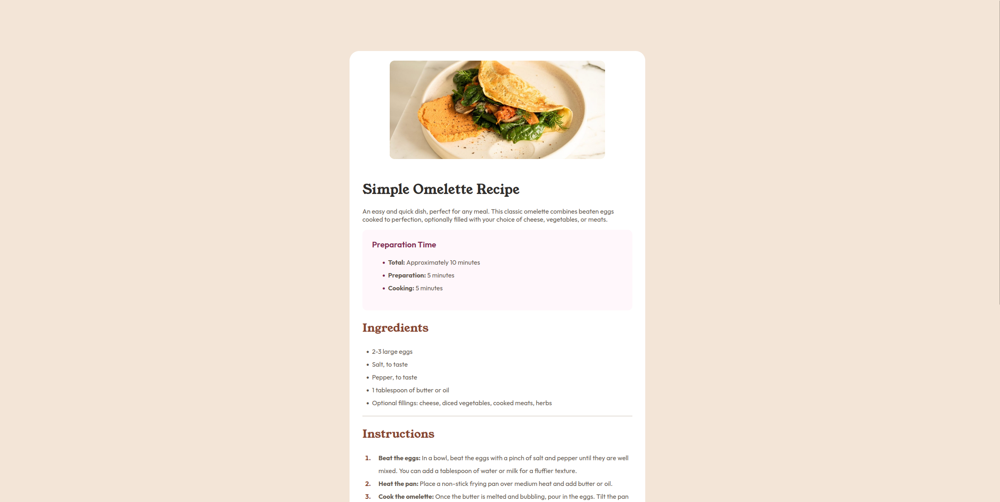

# Frontend Mentor - Recipe page solution

This is a solution to the [Recipe page challenge on Frontend Mentor](https://www.frontendmentor.io/challenges/recipe-page-KiTsR8QQKm). Frontend Mentor challenges help you improve your coding skills by building realistic projects.

## Table of contents

- [Overview](#overview)
  - [The challenge](#the-challenge)
  - [Screenshot](#screenshot)
  - [Links](#links)
- [My process](#my-process)
  - [Built with](#built-with)
  - [What I learned](#what-i-learned)
  - [Useful resources](#useful-resources)
- [Author](#author)

## Overview

### Screenshot

Mobile

Tablet

Desktop

### Links

- Solution URL: [https://github.com/DevAmaruk/Recipe-Page](https://github.com/DevAmaruk/Recipe-Page)
- Live Site URL: [https://devamaruk.github.io/Recipe-Page/](https://devamaruk.github.io/Recipe-Page/)

## My process

### Built with

- Semantic HTML5 markup
- CSS custom properties
- Flexbox
- Mobile-first workflow
- Media Queries

### What I learned

- I learned how to use the "table" tag in HTML to create the layout in the Nutrition section.
- I learned how to use @media queries to modify the layout depending on the screen size
- I learned how to create a divider using the "hr" tag

## Author

- Github - [Devamaruk](https://github.com/DevAmaruk)
- Frontend Mentor - [@DevAmaruk](https://www.frontendmentor.io/profile/DevAmaruk)
- Linkedin - [Jonathan Guthauser](https://www.linkedin.com/in/jguthauser/)
